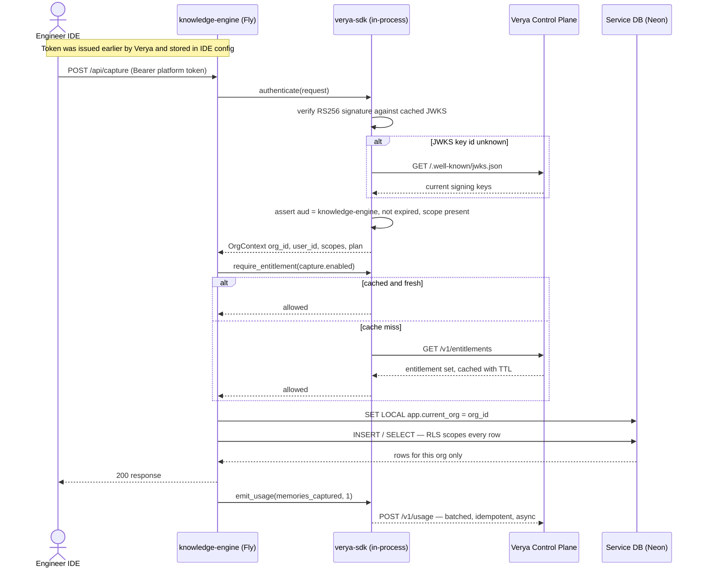
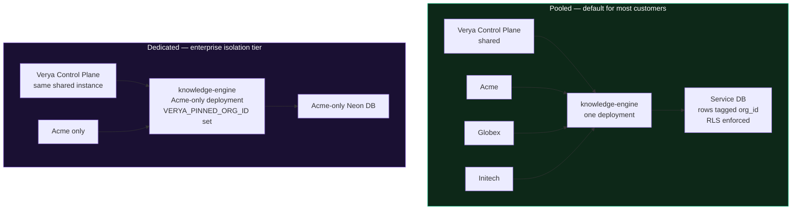

# Verya — Platform Architecture

> **Theme:** Runtime architecture of the control plane, the stack it runs on, and how services attach to it.

---

## Component Map

```mermaid
graph TB
    subgraph Edge["Fly.io Anycast Edge — verya.ai"]
        LB["Global Load Balancer\nTLS termination"]
    end

    subgraph Console["Console — Next.js 15"]
        UI["app.verya.ai\nsign-in, org switcher, service tiles\nmembers, tokens, usage, billing, audit"]
        ADM["admin.verya.ai\ninternal back-office"]
    end

    subgraph CPAPI["Control Plane API — FastAPI :8000"]
        AUTHZ["Auth middleware\ntoken verify + org context"]
        R_ID["/v1/auth/*\n/v1/oauth/*\n/.well-known/jwks.json"]
        R_ORG["/v1/orgs/*\n/v1/members/*\n/v1/invitations/*"]
        R_CAT["/v1/services/*\n/v1/subscriptions/*"]
        R_ENT["/v1/entitlements/*"]
        R_MET["/v1/usage/*"]
        R_BILL["/v1/billing/*\n/v1/webhooks/stripe"]
        R_AUD["/v1/audit/*"]
    end

    subgraph CPWORK["Control Plane Workers — Celery"]
        W_MET["usage aggregator\nrolls events into periods"]
        W_BILL["stripe reporter\npushes meters, syncs subs"]
        W_SCIM["SCIM sync\nprovision + deprovision"]
        W_NOTIF["notifications\nquota + invoice emails"]
        BEAT["beat — singleton\nhourly rollup, daily recon"]
    end

    subgraph PlatDB["Neon — verya_platform DB"]
        T_ORG["organizations, org_members\ninvitations, sso_connections"]
        T_USR["users, identities\nservice_accounts, api_keys"]
        T_CAT["services, service_versions\nsubscriptions"]
        T_ENT["plans, plan_features\nentitlement_overrides"]
        T_MET["usage_events, usage_rollups"]
        T_BILL["stripe_customers, invoices"]
        T_AUD["audit_events — append only"]
    end

    subgraph Cache["Upstash Redis"]
        Q["Celery broker + results"]
        C_ENT["entitlement cache"]
        C_RL["rate limit counters"]
        C_IDEM["idempotency keys"]
    end

    subgraph Vendors["External"]
        STRIPE["Stripe\nsubscriptions + meters"]
        WORKOS["WorkOS\nSAML / SCIM federation"]
        RESEND["Resend\ntransactional email"]
    end

    subgraph DataPlane["Service Data Plane — separate repos and deploys"]
        KE["knowledge-engine\nFly.io + its own Neon DB"]
        SDK["verya-sdk\nverify, org context, usage, entitlements"]
    end

    LB --> UI
    LB --> ADM
    LB --> AUTHZ
    UI -->|"session cookie"| AUTHZ
    ADM -->|"staff token"| AUTHZ
    AUTHZ --> R_ID
    AUTHZ --> R_ORG
    AUTHZ --> R_CAT
    AUTHZ --> R_ENT
    AUTHZ --> R_MET
    AUTHZ --> R_BILL
    AUTHZ --> R_AUD

    R_ID --- T_USR
    R_ORG --- T_ORG
    R_CAT --- T_CAT
    R_ENT --- T_ENT
    R_MET --- T_MET
    R_BILL --- T_BILL
    R_AUD --- T_AUD

    R_MET -->|"enqueue"| Q
    Q --> W_MET
    Q --> W_BILL
    Q --> W_SCIM
    Q --> W_NOTIF
    BEAT -->|"schedule"| Q
    W_BILL --> STRIPE
    W_SCIM --> WORKOS
    W_NOTIF --> RESEND
    R_BILL <-->|"webhooks"| STRIPE
    R_ID <-->|"SAML / SCIM"| WORKOS

    R_ENT --- C_ENT
    AUTHZ --- C_RL
    R_MET --- C_IDEM

    KE --- SDK
    SDK -->|"JWKS fetch, cached"| R_ID
    SDK -->|"entitlement check, cached"| R_ENT
    SDK -->|"usage events, batched"| R_MET
    SDK -->|"audit events"| R_AUD

    style Edge fill:#1a1033,color:#fff,stroke:#7a52cc
    style CPAPI fill:#2d1a4a,color:#fff,stroke:#7a52cc
    style CPWORK fill:#2d1a4a,color:#fff,stroke:#7a52cc
    style Console fill:#3b1f6b,color:#fff,stroke:#9a72ec
    style PlatDB fill:#002b1a,color:#fff,stroke:#00e699
    style Cache fill:#2b0000,color:#fff,stroke:#a13030
    style Vendors fill:#1a1a2e,color:#fff,stroke:#4a4a8a
    style DataPlane fill:#0d2818,color:#fff,stroke:#00b377
```



---

## Stack

Chosen to match the team's existing competence — the knowledge-engine design is already FastAPI + Neon + Fly.io + Upstash — so that there is **one operational model**, not two.

| Layer | Choice | Why |
|---|---|---|
| Control plane API | **Python 3.12 + FastAPI**, async SQLAlchemy 2, Alembic | Same stack as the services — one skill set, shared idioms, shared CI templates |
| Console | **Next.js 15 (App Router) + TypeScript + Tailwind** | Server components keep tokens off the client; strong ecosystem for Stripe, tables and charts |
| Database | **Neon PostgreSQL 16**, database `verya_platform` | Branching for staging; RLS for tenancy; already in the stack |
| Queue / cache | **Upstash Redis** | Celery broker, entitlement cache, rate limits, idempotency keys |
| Hosting | **Fly.io** — processes `api`, `worker`, `beat`, `console` | Multi-process from one config; already the deployment target |
| Billing | **Stripe** — Subscriptions + Billing Meters | Seat-based and metered in one system; hosted invoices and tax |
| Enterprise SSO | **WorkOS** — SAML + SCIM | Building SAML in-house is months of work and a permanent liability |
| Email | **Resend** | Already referenced in the knowledge-engine infra docs |
| Secrets | **Fly secrets** | No credentials in the repo or in `fly.toml` |

### Vendor decisions worth defending

- **WorkOS over building SAML.** Enterprise pilots ask for Okta or Entra ID on day one. SAML is a deceptively deep protocol with a long tail of IdP quirks. Buying it converts an open-ended engineering risk into a line item. Verya still issues its own tokens — WorkOS is a federation adapter, not our identity system, so it stays replaceable.
- **Stripe Billing Meters over a homegrown rating engine.** Metered billing is easy to build and brutal to get *correct*: proration, mid-cycle plan changes, credit notes, tax. We own the usage events; Stripe owns the money.
- **One platform database, not one per capability.** At pilot scale a service-per-capability split buys distributed-systems problems and no benefit. The capabilities are separated by schema and module boundary so the split stays possible later.

---

## The Two Planes

| | Control Plane (Verya) | Data Plane (services) |
|---|---|---|
| Owns | Identity, orgs, entitlements, usage counts, invoices, audit | Customer content and all derived data |
| Repo | `Verya` | One repo per service, e.g. `team-ai-knowledge-engine` |
| Database | `verya_platform` on Neon | Its own Neon database, never shared |
| Deploys | Independently | Independently |
| Breach blast radius | Metadata and billing records | That one service's content, for orgs in that deployment |
| Availability requirement | High — a hard outage blocks new sign-ins | Per service SLA |

> **Deliberate consequence:** a control-plane outage must *not* take down the data plane. Services cache JWKS and entitlements, so in-flight work continues. See [Degradation Behaviour](#degradation-behaviour).

---

## Request Path — a developer calls a service



**Latency budget on the hot path:** token verification is local against cached JWKS, and entitlement checks are cached, so a service call adds **no synchronous network hop to Verya**. Usage emission is fire-and-forget and batched.

---

## Deployment Topologies

The same image serves both. The difference is configuration.



| | Pooled | Dedicated |
|---|---|---|
| Isolation | Logical — `org_id` + RLS | Physical — separate app, volume and database |
| Tenancy code | Same | Same, plus a startup assertion that every token's `org_id` matches `VERYA_PINNED_ORG_ID` |
| Cost | Amortised across customers | Priced into the enterprise tier |
| Ops | One deploy | One deploy per dedicated customer — automate before the third one |

> The dedicated tier exists because enterprise security review asks for it. Because it is the same code with a pinned org, it does not fork the roadmap.

---

## Fly.io Process Layout

| Process | Machines | vCPU | RAM | Role |
|---|---|---|---|---|
| `api` | 2 | shared 1x | 512 MB | Control plane FastAPI. Two minimum — sign-in is a hard dependency for every customer. |
| `console` | 2 | shared 1x | 512 MB | Next.js server |
| `worker` | 2 | shared 1x | 512 MB | Celery — aggregation, Stripe sync, SCIM, email |
| `beat` | **1 always** | shared 1x | 256 MB | Celery Beat scheduler — must be a singleton |

> `fly scale count beat=1`. Two beat machines means every scheduled Stripe usage push runs twice, which means customers are billed twice. This is the single most expensive misconfiguration on the platform.

### Scheduled jobs

| Job | Cadence | Purpose |
|---|---|---|
| `rollup_usage` | Hourly at :05 | Aggregate raw `usage_events` into `usage_rollups` per org / service / meter / period |
| `push_meters_to_stripe` | Hourly at :15 | Report rollups to Stripe Billing Meters, idempotent per period |
| `reconcile_subscriptions` | Daily 03:00 UTC | Detect drift between Stripe state and local `subscriptions` |
| `expire_invitations` | Daily 04:00 UTC | Expire invitations older than 14 days |
| `quota_threshold_notices` | Every 6 h | Email admins at 80% and 100% of quota |
| `rotate_signing_key` | Monthly | Publish a new JWKS key, retire the previous one after an overlap window |

---

## Degradation Behaviour

What happens when the control plane is unreachable — the question an enterprise architect will ask.

| Failure | Service behaviour | Rationale |
|---|---|---|
| Verya API down, token still valid | **Full service.** JWKS is cached; the token is self-contained and verifies offline. | A control-plane outage must not stop engineers working. |
| Verya API down, entitlement cache fresh (< TTL) | **Full service.** | A recent cached decision is good enough to trust. |
| Verya API down, entitlement cache stale | **Read-only.** Recall works; capture is rejected with a clear error. | Fail closed on anything that consumes quota or creates cost. |
| Verya API down, token expired | **Reject.** The IDE cannot refresh. | Never accept an unverifiable token. |
| Usage ingest unreachable | Service buffers events on disk and retries with backoff. | Events are idempotent, so replay is safe; under-billing beats blocking work. |
| Stripe unreachable | Subscription changes queue and retry; access is unaffected. | Money can be eventually consistent. Access cannot be wrong. |

**Token TTL is the tuning dial.** Short TTLs tighten revocation; long TTLs widen the outage window a service can ride out. v1 uses 1-hour access tokens and 30-day refresh tokens, with a revocation list checked on refresh.

---

## Environments

| Environment | Neon branch | Fly app | Stripe | Purpose |
|---|---|---|---|---|
| `dev` | `dev` branch | local / `verya-dev` | test mode | Local development; docker-compose Postgres also supported |
| `staging` | `staging` — instant fork of prod, no data copy | `verya-staging` | test mode | Pre-release verification, migration rehearsal |
| `production` | `main` | `verya` | live mode | Customer traffic |

> Migrations are rehearsed on a Neon branch forked from production before every release. A tenancy bug caught in staging is an incident avoided; a tenancy bug in production is a data-leak disclosure.

---

## Repository Layout

Polyrepo — one repo per service — with the SDK published from the platform repo.

```
engineering-solutions-ai/
│
├── Verya/                              ← this repo — control plane
│   ├── apps/
│   │   ├── api/                        FastAPI control plane
│   │   ├── console/                    Next.js customer console
│   │   └── admin/                      internal back-office
│   ├── packages/
│   │   ├── verya-sdk-python/           published to a private index
│   │   └── verya-sdk-ts/               published to a private npm scope
│   ├── contracts/
│   │   ├── openapi.yaml                generated, versioned, the source of truth
│   │   └── service-manifest.schema.json
│   ├── infra/
│   │   ├── fly.toml
│   │   └── migrations/                 Alembic
│   └── docs/
│       ├── platform/
│       └── adr/
│
├── team-ai-knowledge-engine/           ← service repo, depends on verya-sdk
│
└── <future service repos>
```

**Why the SDK lives here.** Polyrepo gives services autonomy, which is what we want. But token verification is security-critical and must not be reimplemented per service — that is how one service ends up accepting an expired token. The SDK is the one shared dependency, versioned semantically, and each service upgrades on its own schedule. It is the narrow waist of the platform.

---

## Related Documents

| Document | Covers |
|---|---|
| `overview.md` | What Verya is, principles, trust boundaries |
| `tenancy.md` | `org_id`, RLS policies, dedicated deployments |
| `identity.md` | Token format, JWKS, SSO, scopes |
| `billing.md` | Plans, meters, Stripe, quotas |
| `service-contract.md` | What a service must implement to join |
