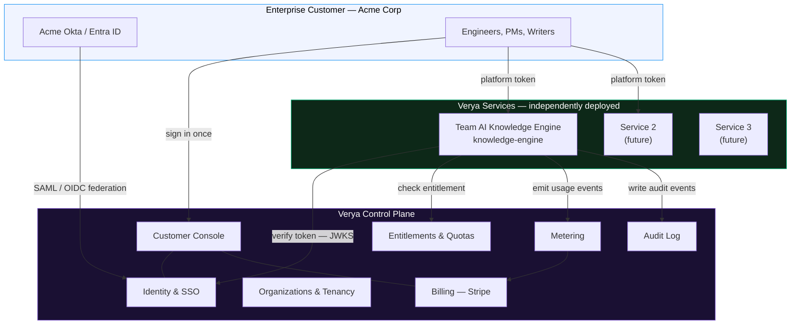
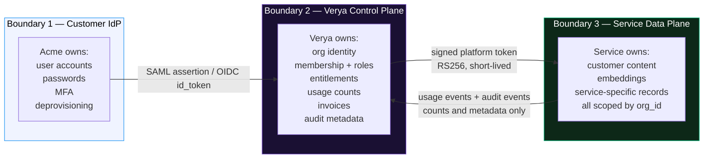

# Verya — Platform Overview

> **Theme:** One enterprise AI platform. Many services. One identity, one tenancy model, one bill.

---

## What Verya Is

Verya is the **control plane** for our enterprise AI solutions. It is not itself an AI product — it is the layer that makes a *portfolio* of AI products sellable to an enterprise.

Every AI service we build needs the same six things before an enterprise will buy it:

1. Who is this person? — identity, federated with the customer's own IdP
2. Which company do they belong to? — organizations and tenancy
3. What are they allowed to use? — entitlements and quotas
4. What did they use? — metering
5. What do they owe? — billing
6. Who did what? — audit

Building those six *inside every service* is how a product company dies. Verya builds them **once**, and each service consumes them through a versioned SDK.



---

## The Portfolio

| Service | Slug | Status | What it does |
|---|---|---|---|
| **Team AI Knowledge Engine** | `knowledge-engine` | In design — Phase 1 | Captures what teams learn in AI sessions, distils it, and injects it back into the next session |
| _(future)_ | — | — | — |

> Verya is built so that service #2 costs a fraction of service #1. If adding a service requires touching identity, billing, or tenancy code, the platform has failed at its job.

---

## Design Principles

| # | Principle | Consequence |
|---|---|---|
| 1 | **The control plane never touches customer content** | Verya stores identity, entitlements, usage *counts*, and audit metadata. It never stores a memory, a prompt, or a document. A Verya breach must not be a content breach. |
| 2 | **Services are independently deployable** | A service can be deployed, rolled back, and scaled without a platform release, and vice versa. The only coupling is the SDK's major version. |
| 3 | **`org_id` is in every row, from the first migration** | Retrofitting tenancy onto a table with production data is a multi-week outage-shaped project. We pay the zero-cost version now. |
| 4 | **Isolation is a deployment choice, not a code fork** | Pooled multi-tenant and single-tenant dedicated run the *same image*. An enterprise that demands physical isolation gets it without a divergent codebase. |
| 5 | **Every privileged action is audited** | Enterprise security review asks this question first. Retrofitting an audit trail is worse than retrofitting tenancy. |
| 6 | **Entitlements fail closed** | If the platform is unreachable, a service serves cached entitlements up to a TTL, then degrades to read-only — it never silently grants unlimited access. |

---

## Trust Boundaries



**The critical invariant:** arrows into the control plane carry *metadata only*. A usage event says `org_id=…, meter=memories_captured, quantity=1`. It never says what was captured.

---

## What a Customer Experiences

```
Day 0  — Admin signs up at verya.ai, creates org "Acme Corp"
Day 0  — Admin connects Acme's Okta (SAML) + enables SCIM provisioning
Day 0  — Admin subscribes Acme to "Team AI Knowledge Engine", Team plan, 25 seats
Day 0  — Admin invites engineers, or SCIM syncs them automatically
Day 1  — Engineer signs in via Okta, lands in the Verya Console
Day 1  — Console shows one tile: Knowledge Engine → "Connect your IDE"
Day 1  — Engineer copies an MCP config block with a scoped token, pastes into Cursor
Day 1  — Engineer works. Sessions are captured. Nobody thinks about the platform again.
Month 1 — Admin sees usage dashboards, seat utilisation, and a Stripe invoice
```

The platform is successful when the only people who notice it are admins and finance.

---

## Scope of the First Build

Verya v1 ships all six control-plane capabilities, because an enterprise pilot cannot start without any one of them:

| Capability | v1 Scope |
|---|---|
| **Identity** | Email+password, Google OIDC, and SAML federation per org. Service accounts for CI. RS256 tokens with JWKS rotation. |
| **Tenancy** | Organizations, members, roles, invitations. `org_id` + Postgres RLS enforced platform-wide and mandated for services. |
| **Catalog** | Service manifests, per-org enablement, connection instructions surfaced in the Console. |
| **Entitlements** | Plans, feature flags, hard and soft quotas, with a cached fail-closed evaluation path in the SDK. |
| **Metering** | Idempotent usage-event ingest, aggregation, roll-up to Stripe meters, quota feedback. |
| **Billing** | Stripe subscriptions, seat-based + metered line items, self-serve plan changes, hosted invoice portal. |
| **Audit** | Append-only audit log for every privileged action, exportable by the customer. |
| **Console** | Sign-in, org switcher, service tiles, members & roles, tokens, usage, billing, audit. |
| **Admin** | Internal back-office: provision orgs, grant trials, inspect usage, audited impersonation. |

> **Explicitly out of v1:** marketplace/third-party services, per-service custom domains, on-prem/air-gapped installs, usage-based alerting beyond quota thresholds.

---

## Related Documents

| Document | Covers |
|---|---|
| `architecture.md` | Runtime architecture, components, deployment topology |
| `tenancy.md` | Organizations, `org_id` propagation, Postgres RLS, dedicated deployments |
| `identity.md` | Token format, JWKS, SSO federation, service accounts, scopes |
| `billing.md` | Plans, meters, Stripe integration, quota enforcement |
| `service-contract.md` | What a service must implement to join the platform |
| `../adr/` | Architecture decision records |
