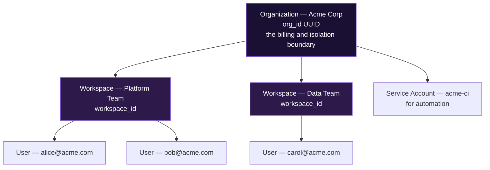
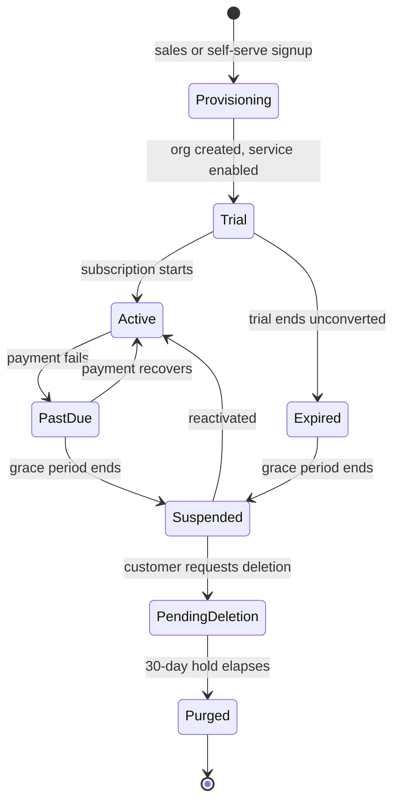

# Verya — Tenancy Model

> **Theme:** One rule, enforced by the database: **no row exists without an owner, and no query crosses an owner boundary.**

This is the most consequential document in the platform. Every other mistake is recoverable. A cross-tenant data leak is a disclosure event, a lost pilot, and in several jurisdictions a regulatory filing.

---

## The Hierarchy



| Level | Identifier | What it is | Who creates it |
|---|---|---|---|
| **Organization** | `org_id` UUID | The enterprise customer. The billing boundary, the isolation boundary, the security boundary. | Verya, at signup or sales provisioning |
| **Workspace** | `workspace_id` UUID | An optional sub-grouping inside an org — a team, a department, a business unit. Scopes *sharing*, not *security*. | Org admin |
| **User** | `user_id` UUID | A person. Globally unique across Verya; may belong to several orgs. | Verya, via signup / invitation / SCIM |
| **Service account** | `service_account_id` UUID | A non-human principal for CI and automation. Belongs to exactly one org. | Org admin |

### Two boundaries, deliberately different in strength

- **`org_id` is a security boundary.** Enforced by the database via row-level security. A bug in application code cannot cross it.
- **`workspace_id` is a sharing boundary.** Enforced by application logic. It answers "should the Data Team see the Platform Team's memories?" — a product question, not a security question.

> Conflating the two is the classic mistake. Teams enforce sharing in the database and security in the application, and get both wrong. Keep them separate: **the database protects tenants; the application arranges teams.**

### How this maps onto the knowledge-engine's existing design

The current knowledge-engine schema has `teams` and `team_members` and no tenant concept. Under this model:

| Current | Becomes |
|---|---|
| `teams` | `workspaces` — an org-scoped grouping |
| `team_members` | `workspace_members` |
| `users` (with `password_hash`, `jwt_token`) | Removed. Identity is the platform's job; the service holds only a cached user projection. |
| `memories.scope = personal \| team` | `memories.visibility = private \| workspace \| org`, all inside one `org_id` |

---

## Rule 1 — Every Tenant Table Carries `org_id`

Not a nullable column. Not a column added in a later migration. Not "we'll join through a parent table."

```sql
CREATE TABLE memories (
    id           UUID        PRIMARY KEY DEFAULT gen_random_uuid(),
    org_id       UUID        NOT NULL,          -- ← first column after the key. Always.
    workspace_id UUID,                          -- nullable: org-wide rows have no workspace
    -- ... service-specific columns ...
    created_at   TIMESTAMPTZ NOT NULL DEFAULT NOW()
);
```

**Why `org_id` on every table instead of joining to a parent:**

1. RLS policies must be expressible on the table itself — a policy that joins is slow and easy to get wrong.
2. Every index becomes `(org_id, …)`, which is also the access pattern, so tenancy makes queries *faster*, not slower.
3. A stray `DELETE` or `UPDATE` without a join is still contained.
4. Sharding by tenant later requires no schema change.

The cost is a denormalised column. The benefit is that a missing `WHERE` clause cannot leak another customer's data. That trade is not close.

### Naming rule

The column is **`org_id`**, everywhere, in every service, forever. Not `organization_id`, not `tenant_id`, not `account_id`. One name means a repo-wide grep is a complete audit, and a lint rule can enforce it.

---

## Rule 2 — Postgres Row-Level Security Enforces It

Application-level filtering is a convention. RLS is a guarantee.

```sql
-- Enable RLS and force it even for the table owner
ALTER TABLE memories ENABLE ROW LEVEL SECURITY;
ALTER TABLE memories FORCE ROW LEVEL SECURITY;

-- The tenant isolation policy
CREATE POLICY memories_org_isolation ON memories
    USING      (org_id = current_setting('app.current_org', TRUE)::uuid)
    WITH CHECK (org_id = current_setting('app.current_org', TRUE)::uuid);
```

`USING` filters reads, `WITH CHECK` constrains writes. Both are required: without `WITH CHECK`, a tenant can *insert* a row belonging to another tenant.

**`FORCE ROW LEVEL SECURITY` is not optional.** Without it, the table owner — which is usually the role your migrations and often your application connect as — bypasses every policy. This is the single most common way an RLS deployment turns out to have been decorative all along.

### Connection roles

| Role | RLS | Used by | Notes |
|---|---|---|---|
| `app_user` | **Enforced** | All application request handling | Not the table owner. Cannot bypass RLS. |
| `app_migrator` | Bypasses | Alembic migrations only | Separate credential, never in the app process |
| `app_admin` | Bypasses | Break-glass operations | Audited, MFA-gated, time-boxed |

> The application must never connect as the table owner. If it does, every policy in this document is inert.

### Setting the org context

`SET LOCAL` is scoped to the transaction, so it cannot leak across pooled connections — which matters because Neon puts PgBouncer in front of the database.

```python
# verya_sdk.db — every request-scoped session goes through this
@asynccontextmanager
async def org_session(engine, ctx: OrgContext):
    async with engine.begin() as conn:
        await conn.execute(
            text("SET LOCAL app.current_org = :org"),
            {"org": str(ctx.org_id)},
        )
        yield conn
```

**Three requirements, each one load-bearing:**

1. `SET LOCAL`, never `SET` — session-level settings persist on a pooled connection and get handed to the next tenant.
2. Inside the transaction that does the work — a separate transaction sets nothing useful.
3. Parameterised — `org_id` comes from a verified token, but string-formatting it into SQL is an injection habit you do not want anywhere near the tenancy layer.

### The nullable-setting trap

`current_setting('app.current_org', TRUE)` returns `NULL` when the setting is absent — and `org_id = NULL` is `NULL`, which RLS treats as *not visible*. So a forgotten `SET LOCAL` fails closed: the query returns zero rows.

That is the correct direction to fail, but a silent empty result is a confusing bug. Services should assert explicitly:

```python
if ctx is None or ctx.org_id is None:
    raise MissingOrgContext("no org context on a tenant query")
```

Fail loudly in the application; fail closed in the database. Both.

---

## Rule 3 — `org_id` Comes From the Token, Never From the Request

```python
# CORRECT — from the verified token
ctx = verya.authenticate(request)       # RS256-verified
org_id = ctx.org_id

# CATASTROPHIC — attacker-controlled
org_id = request.headers["X-Org-Id"]
org_id = request.query_params["org_id"]
org_id = body.org_id
```

If a request body or header can influence which tenant is queried, the platform has no tenancy. The SDK does not expose a way to construct an `OrgContext` from untrusted input, and the code review checklist has this as a blocking item.

**The one exception** is a Verya staff impersonation token, which carries `act_as_org` plus an `impersonation_id`. It is issued only by the admin app, is short-lived, and writes an audit event on every request made with it.

---

## Rule 4 — Indexes Lead With `org_id`

Every tenant query filters by `org_id`, so it belongs first in the index.

```sql
CREATE INDEX idx_memories_org_created   ON memories (org_id, created_at DESC);
CREATE INDEX idx_memories_org_workspace ON memories (org_id, workspace_id);
CREATE UNIQUE INDEX uq_memories_org_slug ON memories (org_id, slug);
```

**Uniqueness is per-org, not global.** Acme and Globex may both have a memory with the slug `auth-refactor`. A globally unique constraint leaks the existence of other tenants' data through constraint-violation errors — a real, exploited side channel.

### Vector indexes

pgvector's IVFFlat and HNSW indexes do not partition by tenant. A search executes across all vectors and RLS filters the result, which means recall quality degrades as unrelated tenants' data grows.

| Scale | Approach |
|---|---|
| Pilot — under ~1M vectors total | Single index. RLS filters post-search. Over-fetch by 3–5× before filtering to protect recall. |
| Growth | Partition the table by `org_id` hash; each partition carries its own index. |
| Large enterprise | Dedicated deployment — its own database, its own index. |

> This is a known scaling cliff, and it arrives sooner than teams expect. It is written down here so the migration is planned rather than discovered during an incident.

---

## Rule 5 — Cross-Tenant Queries Are Explicit, Rare, and Audited

Legitimate cases exist: platform-wide analytics, billing aggregation, support investigation. They go through a separate, obvious path.

```python
# Ordinary path — RLS enforced, org-scoped
async with verya.org_session(ctx) as db: ...

# Cross-tenant path — different function name, requires a reason, writes an audit event
async with verya.admin_session(reason="billing rollup", actor=staff_id) as db: ...
```

Rules: `admin_session` lives in a module services do not import; it connects as `app_admin`; it takes a mandatory `reason`; it emits an audit event. Anything that looks like `admin_session` in a service repo fails review.

---

## The Dedicated Deployment Tier

Enterprise security review will eventually ask for physical isolation. The answer is configuration, not a fork.

```bash
# Dedicated deployment for Acme
VERYA_PINNED_ORG_ID=8f14e45f-ceea-467a-9f0a-6b2c1d3e4f50
DATABASE_URL=postgresql+asyncpg://…@acme-dedicated.neon.tech/knowledge_engine
```

When `VERYA_PINNED_ORG_ID` is set, the SDK adds a hard assertion in the auth path:

```python
if settings.pinned_org_id and ctx.org_id != settings.pinned_org_id:
    raise WrongTenantForDeployment(
        f"token org {ctx.org_id} on a deployment pinned to {settings.pinned_org_id}"
    )
```

RLS still runs. The pin is defence in depth: a valid token for the wrong customer, pointed at the wrong deployment, is rejected before it touches the database.

| Guarantee the customer gets | How |
|---|---|
| Their data is in a database no other customer touches | Separate Neon project |
| Their traffic runs on machines no other customer uses | Separate Fly app |
| A bug in another tenant's request cannot reach their data | No other tenant's requests exist here |
| Their data can be deleted by destroying the infrastructure | Drop the Neon project, destroy the Fly app |

Same image, same migrations, same SDK. The only divergence is environment configuration — which is the entire point.

---

## Tenant Lifecycle



| State | Read | Write | Data retained |
|---|---|---|---|
| `trial` | Yes | Yes | Yes |
| `active` | Yes | Yes | Yes |
| `past_due` | Yes | Yes | Yes — never destroy data over a failed card |
| `suspended` | **Export only** | No | Yes |
| `pending_deletion` | Export only | No | Yes, for 30 days |
| `purged` | No | No | **No** |

### Deletion

An enterprise contract will require deletion within a stated window, across every service. Each service exposes two endpoints that only Verya may call, authenticated with a platform-issued service token:

```
POST /internal/tenant/{org_id}/export     → signed URL to a complete archive
POST /internal/tenant/{org_id}/purge      → hard delete, returns a signed receipt
```

Verya fans these out across every service the org subscribed to, tracks per-service completion, and issues a single deletion certificate to the customer. A service that cannot prove deletion blocks the certificate.

> **Purge means purge:** rows, uploaded files, vector entries, search indexes, derived caches, and log lines containing content. Backups are the hard part — state your backup retention in the contract rather than claiming instant deletion you cannot deliver.

---

## Testing Tenancy

Tenancy is not a feature you review once. It is an invariant you test continuously.

| Test | What it proves | When it runs |
|---|---|---|
| **Two-tenant fixture** — every integration test seeds Acme and Globex with identical-looking data, and asserts Acme's request never sees a Globex row | Isolation holds on the real query paths | Every CI run |
| **Missing-context test** — run each tenant query without `SET LOCAL` and assert zero rows | RLS fails closed | Every CI run |
| **Schema lint** — assert every table in the tenant schema has a non-null `org_id`, RLS enabled, `FORCE` set, and a policy | No table is ever added without tenancy | CI, blocking |
| **Index lint** — assert every index on a tenant table leads with `org_id` | Performance and correctness | CI, warning |
| **Owner check** — assert the app role is not the table owner | RLS is actually in force | Startup and CI |
| **Pinned-org test** — dedicated config rejects a foreign-org token | Defence in depth works | Every CI run |

The two-tenant fixture is the highest-value test on the platform. It costs an afternoon to build and it is the thing that lets you answer "how do you know?" in a security review with evidence rather than assurance.

---

## Checklist for Any New Tenant Table

Copy this into the PR description.

- [ ] `org_id UUID NOT NULL` is present, immediately after the primary key
- [ ] `workspace_id UUID` present if the data is shareable within an org
- [ ] `ALTER TABLE … ENABLE ROW LEVEL SECURITY`
- [ ] `ALTER TABLE … FORCE ROW LEVEL SECURITY`
- [ ] Isolation policy created with **both** `USING` and `WITH CHECK`
- [ ] Every index leads with `org_id`
- [ ] Every unique constraint is scoped `(org_id, …)`, never global
- [ ] Foreign keys point only at tables in the same org — or the reference is validated in the same transaction
- [ ] Covered by the two-tenant isolation test
- [ ] Included in the tenant export and purge paths

---

## Related Documents

| Document | Covers |
|---|---|
| `overview.md` | What Verya is, principles, trust boundaries |
| `architecture.md` | Runtime architecture, deployment topology |
| `identity.md` | Where `org_id` comes from — token format and issuance |
| `service-contract.md` | What a service must implement, including export and purge |
